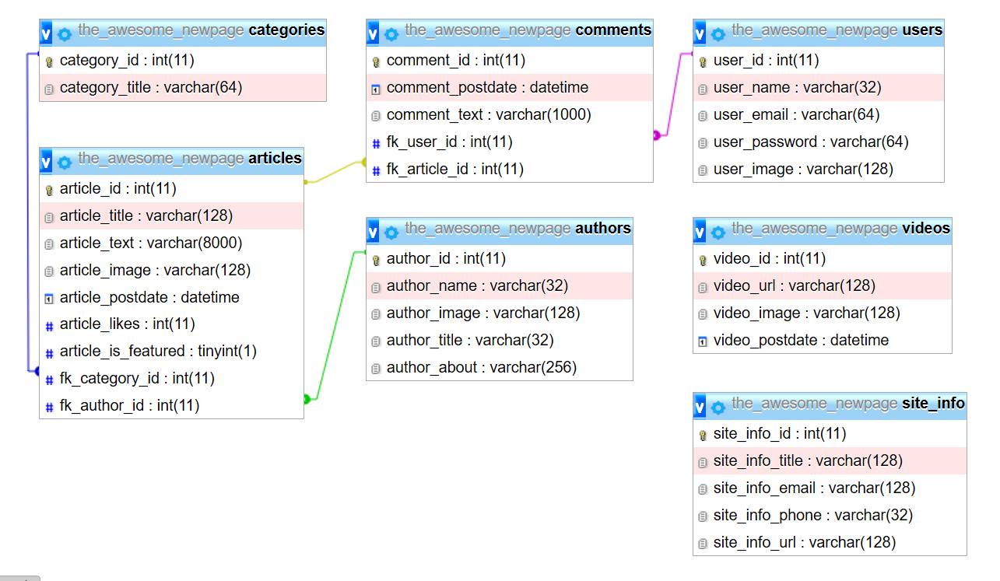

# Implementer dataudtræk på siden

Nu hvor der er oprettet en database i stil med diagrammet, så skal siden gøres dynamisk der hvor vi kan gøre den dynamisk.





Der er behov for at tilpasse et par routes, da de fremover skal være baseret på en bestemt værdi fra adressebaren.

Det er **categories-post** og **single-post** der skal udvides.

Først kopieres den nuværende route, så vi ikke ødelægger noget endnu.

Derefter tilføjes en `parameter` til `endpoint` adressen.

et parameter kan genkendes ved at have et foranstillet : *kolon* 

`:category_id` er et parameter, og vil repræsentere den værdi der står efter skråstregen `/` i endpoint adressen.

dvs: `/categories-post/3` der er `3` parameter værdien, som er tilgængelig i route koden via `req.params.category_id`  

```javascript
app.get('/categories-post/:category_id', async (req, res, next) => {
   res.send(req.params.category_id); // for demonstrationens skyld! 

   // her kan alle kategoriens artikler hentes osv...
});
```

Med denne ændring i vores route, vil det være muligt at omskrive alle links der peger på en kategori, så den medtager kategoriens id, og artiklerne kan hentes ud baseret på adressebaren... det er smart og gør siden meget dynamisk.

Nu hvor route er oprettet, så skal alle links ændres så de peger på et nye endpoint.

i navigationen, efter **Mega Menu** dropdown området, der er en udskrift af 7 kategorier, dem skal vi gøre dynamiske, så det ser ud i stil med følgende:
```javascript
<% if(typeof categories != 'undefined'){ %>
   <% categories.forEach(category =>{ %>
      <li><a href="/category/<%=category.category_id %>"><%=category.category_title %></a></li>
   <% }); %>
<% } %>
```

Og hver route der rammes og skal vise menuen, skal have et databseudtræk der henter kategorierne.

Når siden indlæses, vil navigationen være konstrueret af et SQL kald, og være dynamisk.

---

Det næste er at få hentet de artikler der hører til den valgte kategori.

Her skal SQL udtrækket have en parameter, og det skal skrives på en lidt speciel måde, nemlig ved at benytte et `?` istedet for den faktiske værdi.
```SQL 
SELECT * FROM articles WHERE fk_category_id = ?
```

Hvert `?` der sættes i SQL sætningen, skal have en værdi tilknyttet, den defineres efter SQL sætningen, i et sæt firkant paranteser (fordi mysql2 forventer et array)

```javascript
let [articles] = await db.execute('SELECT * FROM articles WHERE fk_category_id = ?', [req.params.category_id]);
```

På den måde hentes alle artikelernme der har samme værdi i `fk_category_id`, som der står i adressebaren efter den sidst `/`.

## ALLE steder på sitet, hvor kategori står i et link, skal opdateres så det linker til den nye route!

Alle links der linker til artikler, skal opdateres så de peger på `/single-post/XXX` hvor XXX er artiklens id.

Og den route der tager sig af at vise en specifik artikel skal have en SQL sætning der henter den pågældende artikel.

---

Der er flere visninger på siden, hvor det ikke er den fulde artikel der vises, f.eks. under *latest-post-widget* ses kun kategori-titel, artikel-titel, artikel-billede og artikel-dato. De SQL sætninger der skal hente ud af databasen, skal tilpasses så det kun er de ønskede felter der hentes ud.

Her kan det være en fordel at kapsle SQL sætningen ind i `backticks` \` så det er muligt at have flere linjer efter hinanden:
```javascript
let [articles] = await db.execute(`
   SELECT category_title, article_title, article_image, article_postdate 
   FROM articles 
   WHERE fk_category_id = ?`, [req.params.category_id]);
```

Der er også flere steder hvor der skal sorteres efter datoen, der er det vigtigt at vide i hvilken rækkefølge de forskellige SQL nøgleord skal placeres.

```SELECT ... FROM ... JOIN(s) ... WHERE ... ORDER BY ... LIMIT``` 

---

Der er flere steder på siden hvor forfatter navnet står i et link, det kunne man også ændre så det peger ind på et endpiont der kan vise en forfatters detaljer, der må du komme med et forslag!
