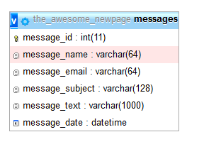

# Indsættelse af data i database

De data vi har sat i databasen, har vi manuelt indsat via phpmyadmin, men det er også muligt at indsætte via kode, så formular data kan benyttes til at oprette nye records i databasen.

## body-parser

For at kunne indsætte data fra en formular, har vi brug for et modul der kan håndtere formular data:

`npm install body-parser --save`

Derudover skal modulet knyttes til vores express-app, det sker i `app.js`, f.eks. lige efter afsnittet der knytter  `morgan`  til app.

```javascript
const bodyParser = require('body-parser');
app.use(bodyParser.json());
app.use(bodyParser.urlencoded({
   extended: true
}));
```

Nu er det muligt at modtage formular data på serversiden, og arbejde med det igennem `req.body`, lidt lige som `req.params`.

## route til at modtage formular data

For at kunne sende data skal vi benytte en `POST` metode, frem for den `GET` som vi har benyttet ind til videre. Lad os tage udgangspunkt i kontakt formularen på nyhedssiden, og oprette en route der kan modtage kontakt formular data:
```javascript
//  tilføjes i routes.js filen f.eks. lige under app.get('/contact') endpoint
app.post('/contact', (req, res, next) => {
   res.send(req.body);
});
```

Det kræver vi også tilpasser formularen en lille smule, da den nu skal sende data til `/contact` endpoint, frem for til `#` som den gør i skabelonen.

til det fjerner vi simplethen `action="#"` fra `form` tagget. det betyder at formularen sender data til samme adresse som den står på. Det er vigtigt at beholde `method="post"` da vi jo ønsker at sende via `POST` metoden.

En sidste detalje vi skal sikre os, er at samtlige inputfelter har et `name="feltets-navn"` ellers vil body-parser ikke modtage værdierne. Så tilføj det, der hvor `name` mangler.

Og så kan formularen testes.

## validering og fejlbeskeder, før vi kan indsætte

For at kunne indsætte data i databasen, skal vi benytte `SQL` kommandoen `INSERT INTO` 

vi skal beskrive hvilken tabel der skal indsættes data, samt hvilke felter i tabellen, og hvilke værdier der skal indsættes. Her er et eksempel på sætningens struktur:

`db.execute('INSERT INTO table (field1, field2, field3) VALUES(?,?,?)', [value1, value2, value3]);`

Da vi skal modtage formular data, og indsætte dem i databasen, er det altid vigtigt at sikre sig der værdier i alle felterne først, så vi skal lige starte med en grundlæggende validering af formular data.

Her ses et eksempel på hvordan `POST` `/contact` kan se ud. Husk at `req.body.email` repræsenterer det inputfelt der har `name="email"`

```javascript
app.post('/contact', async (req, res, next) => {

   // indsamling af værdierne og oprettelse af de nødvendige variabler.
   let name = req.body.name;
   let email = req.body.email;
   let subject = req.body.subject;
   let message = req.body.message;
   let contactDate = new Date();

   // håndter valideringen, alle fejl pushes til et array så de er samlet ET sted
   let return_message = [];
   if (name == undefined || name == '') {
      return_message.push('Navn mangler');
   }
   if (email == undefined || email == '') {
      return_message.push('Email mangler');
   }
   if (subject == undefined || subject == '') {
      return_message.push('Emne mangler');
   }
   if (message == undefined || message == '') {
      return_message.push('Beskedteksten mangler');
   }

   // dette er et kort eksempel på strukturen, denne udvides selvfølgelig til noget mere brugbart
   // hvis der er 1 eller flere elementer i `return_message`, så mangler der noget
   if (return_message.length > 0) {
      // der er mindst 1 information der mangler, returner beskeden som en string.
      res.send(return_message.join(', '));
   } else {
      // send det modtagede data tilbage, så vi kan se det er korrekt
      res.send(req.body);
   }
});
```


Det ville selvfølgelig være fedt hvis formularen kunne vises igen, med en fornuftig fejlbesked, hvis der var opstået en fejl. Så det tilføjer vi.

I kontakt ejs template filen, tilføjes denne kodestump, f.eks. lige før det div-tag formularen hører til.
```javascript
<% if( typeof return_message != 'undefined'){ %>
   <h4><%= return_message %></h4>
<% } %>
```

Og hvert input felt skal have en `value` så de felter der blev sendt, kan forudfyldes med værdien når formularen vises igen. Her ses eksempel der hører til inputfeltet med `name="email"`:


`value="<%= typeof values != 'undefined' ? values.email: '' %>"`

Sørg for alle felterne har en value, på nær `textarea` det ser lidt anderledes ud (åbne textarea tagget skal indeholde flere attributter!, de er blot udeladt i eksemplet her):

`<textarea name="message"><%= typeof values != 'undefined' ? values.message : '' %></textarea>`

Og til sidst skal route tilpasse en lille smule, så de modtaget værdier der er korrekte, kan sendes til template filen:

```javascript
if (return_message.length > 0) {
   // der er mindst 1 information der mangler, returner beskeden som en string.
   let categories = await getCategories(); // denne forklares lige om lidt!
   res.render('contact', {
      'categories': categories,
      'return_message': return_message.join(', '),
      'values': req.body // læg mærke til vi "bare" sender req.body tilbage
   });

} else {
   res.send(req.body);
}
```

For at kunne teste dette, så vi med garanti ved der opstår en fejl, så prøv at ændre `name` i et af felterne, så det helt sikkert ikke eksisterer i `req.body`.

## indsætte data i databasen

Nu er vi klar til at kunne indsætte i vores database. Her er det selvfølgelig nødvendigt at have en tabel til vores kontakt-data.

Eksempel:



Med en struktur der ligner eksemplet, kan vi skrive denne SQL sætning:

```javascript
let db = await mysql.connect();
let result = await db.execute(`
   INSERT INTO messages 
      (message_name, message_email, message_subject, message_text, message_date) 
   VALUES 
      (?,?,?,?,?)`, [name, email, subject, message, contactDate]);
db.end();
```

Dog er det nok også nødvendigt at kunne håndtere hvis indsættelsen fejler, samt skrive en besked til brugeren når beskeden er modtaget.
så tilføj dette efter SQL indsættelsen:

```javascript
// affected rows er større end nul, hvis en (eller flere) række(r) blev indsat
if (result[0].affectedRows > 0) {
   return_message.push('Tak for din besked, vi vender tilbage hurtigst muligt');
} else {
   return_message.push('Din besked blev ikke modtaget.... ');
}

let categories = await getCategories(); // denne har jeg ikke forklaret endnu! 
res.render('contact', {
   'categories': categories,
   'return_message': return_message.join(', '),
   'values': req.body
});
```


## getCategories() funktionen

Der er et par steder i koden hvor jeg henter kategorien ud via en funktion, frem for `db.execute()`. Der kræver nok lige en forklaring

I min route fil, før `module.exports = (app) => {` linjen, har jeg oprettet en ny `async funktion` kaldet `getCategories` fordi jeg flere steder i mine routes har brug for at hente den samme data. Det giver mening at oprette funktioner til de handlinger man skal foretage mere end 1 gang.

```javascript
async function getCategories() {
   let db = await mysql.connect();
   let [categories] = await db.execute(`
      SELECT category_id, category_title 
      FROM categories
      ORDER BY category_title ASC`);
   db.end();
   return categories;
}
```

Nu kan jeg trække alle kategorierne ud ved et enkelt funktions kald:

`let categories = await getCategories();`

Og hvis jeg efterfølgende finder på at ændre i min database så SQL kaldet skal opdateres, er der kun ET sted i min routefil jeg skal ændre, frem for SAMTLIGE steder jeg ønsker at trække alle kategorierne ud... det er ret smart! Sørg for de SQL sætninger der går igen i flere routes, er trukket ud i en seperat funktion.

